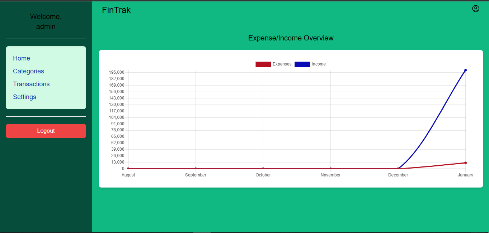

# Finance Tracker App 🚀


[](https://github.com/i-christian/fintrak/actions/workflows/tests.yml)
[](https://github.com/i-christian/fintrak/issues)
[](https://github.com/i-christian/fintrak/graphs/contributors)
[](https://github.com/i-christian/fintrak/commits/main)
[](https://github.com/i-christian/fintrak/releases)

## Description

FinTrak is a finance tracking app designed to help users manage their personal finances effectively. The app offers category management, streamlined transaction tracking features, and insightful reports.

Built with a modern tech stack, FinTrak utilizes Rust for its high-performance backend, SolidJS for a reactive and intuitive frontend, and PostgreSQL for secure and efficient data management. Containerized with Docker, it ensures seamless development and deployment.

### Key Features
- [x] **User Authentication**: Allow users to create accounts using an email address and password.
- [x] **Personal Management**: Create and track expenses & income throughout the month.
- [x] **Category Management**: Define custom income and expense categories for users.
- [x] **Transaction Tracking**: Log and manage transactions for individuals, categorized as expense or income.
- [x] **Cross-Platform Accessibility**: A responsive, dynamic UI that works seamlessly across all devices.
- [x] **Generate Graphical Insights**: Show the trends of income and expenses for the last 6 months on a graph.
- [x] **Financial Reports**: Generate summaries of income and expenses for specific time periods.

### Possible Future Features
- [ ] **Export reports to Pdf or spreadsheets**: Allow users to download their finance reports.
- [ ] **Budgeting**: Creating budgets to specify monthly target expenses for each category and tracking them against transactions.
- [ ] **Notifications**: Implement a notification system that sends users various kinds of alerts.

## Application Screenshots

Here are some screenshots of the app to give you an overview of its features:

### Login Page

The login page allows users to sign in or create an account to start tracking their finances.

### Register Page

This page allows users to create a new account by providing their email address and setting a password.

### Add Category Page

Users can easily add a new custom category, which they can later use to create transactions

### Add Transaction Page

Users can easily add a new transaction, categorizing it using their custom defined categories.

### Transaction Page

Here, users can view and manage their transaction history in a user-friendly interface.

### Insights Page

This page displays graphical insights into the user's financial trends, including income vs. expenses over the past 6 months.

## Prerequisites 📋
- [Rust](https://www.rust-lang.org/)
- [Axum](https://docs.rs/axum/latest/axum/)
- [Node v18 & npm](https://nodejs.org/)
- [PostgreSQL](https://www.postgresql.org/)
- [SolidJS](https://docs.solidjs.com/)
- [Docker](https://www.docker.com/)

## How to Use 🛠️

### Clone the Repository
Clone the `fintrak` repository to your local machine:
```
  git clone https://github.com/i-christian/fintrak.git && cd fintrak
```


### Running with Docker 🐳
- **Build and Start**: Ensure Docker is installed, then run the following command to build and start the services.
```
  docker compose up -d
```


- **Access the Application**: Once the container is running, access FinTrak at: `http://localhost:3000`


- **Stop the Service**: Run the following command to stop the service:
 ```
  docker compose down --remove-orphans
```


### Run the Application (without Docker)
```
  ./build.sh
```


## Contributing 🤝

I welcome contributions to improve FinTrak. Here’s how you can get started:

1. Fork the repository.
2. Create a new branch (`git checkout -b feature-branch`).
3. Make your changes.
4. Commit your changes (`git commit -am 'Add new feature'`).
5. Push to the branch (`git push origin feature-branch`).
6. Create a new Pull Request.

## Licensing 📄
FinTrak is licensed under the MIT License. See the [LICENSE](LICENSE) file for details.

## Acknowledgements 🙌
Special thanks to the developers of Rust, Axum, and SolidJS for their excellent tools and libraries.

Enjoy using FinTrak! 🚀
